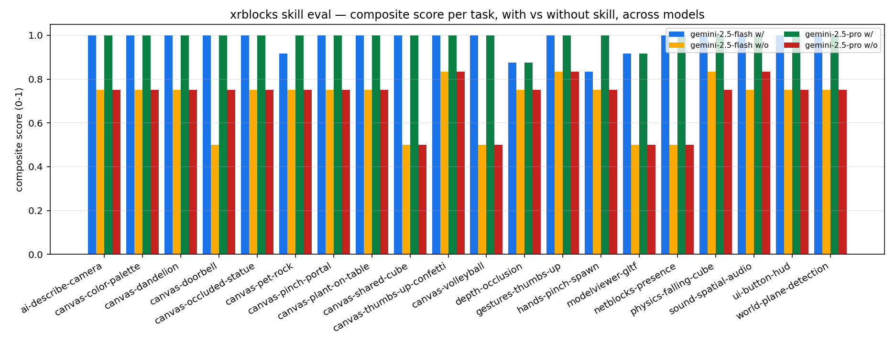
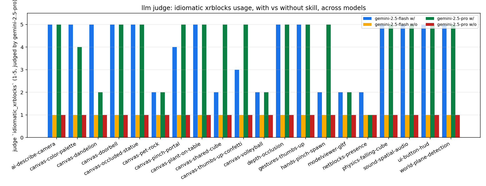

# Findings

A reproducible benchmark for the `xb-*` skills used by Gemini Canvas Gems when generating xrblocks apps. This document records what we tried, what failed, and what the current sweep shows.

## v1: Replay merged PRs as the benchmark

The first attempt took recent merged PRs and materialised each as `prompt + base_sha + golden.diff`. An agent ran at the base commit, and the resulting diff was scored against the golden one. The harness consisted of `evals/fetch_prs.py`, `score.py`, `summarize.py`, and `setup_worktree.sh`, against a seed set of six mid-size merged PRs (`#325 #326 #328 #329 #330 #335`). End-to-end was verified with two smoke tests: feeding the golden diff back as the agent's output scored 1.0 across the board, and an empty diff scored 0.0.

Running task `#335` ("Fix interactions in Netblocks sample") with `gemini-cli`, with and without the 13 `xb-*` skills installed at user scope, gave identical results in both modes: Jaccard 0.40, recall 0.50, line similarity around 0.6. Reading the in-repo `skills/README.md` made the reason clear. The repository hosts two distinct documentation surfaces:

- `skills/xb-*/SKILL.md` is intended for an agent that is helping a *user* build a new app with xrblocks.
- `AGENTS.md`, `CONTEXT.md`, `src/SKILL.md`, and `src/addons/*/SKILL.md` are intended for an agent acting as a *contributor* to the xrblocks repository.

Merged PRs are contributor work. The `xb-*` skills target user prototyping. Loading them for a PR-replay task therefore moved no needles, exactly as the design predicted in hindsight.

## v2: Prototyping tasks via gemini-cli

The second attempt swapped task selection. Handcrafted "build an X with xrblocks" prompts ran in a clean template, scored on imports, API names, parse-ok, and forbidden patterns. The harness lived under `evals/prototypes/tasks/<id>/{prompt.md, spec.json}` with `runners/run_prototype.sh` and `score_proto.py`.

The first run (`netblocks-presence` with and without `xb-netblocks` installed) produced identical files byte-for-byte at 2581 bytes. Two factors caused this. The task prompt was unambiguous enough that the skill content carried no additional disambiguation. More importantly, `gemini-cli` granted the agent filesystem access to the workspace, so skill activation depended on automatic discovery rather than explicit prompt injection. Binary import-and-API scoring also has a known ceiling on easy tasks, where any non-zero signal converges to 1.0.

## v3: Gem-faithful evaluation via the Gemini API

The actual production target is not `gemini-cli`. It is the Gemini Canvas Gem "XR Blocks for Gemini Canvas v0.14.1", which bakes skill content into its system prompt, runs in Canvas mode without shell access, has no filesystem visibility into the xrblocks repo, and uses Gemini Pro for serious generation.

To mirror this faithfully, we now call `gemini-2.5-pro` directly through the `google-genai` SDK. The system prompt is either the concatenated `xb-*` `SKILL.md` content (with-skill arm) or empty (without-skill arm). The user message is the prototyping prompt. The model must produce a complete `main.js` from scratch with no filesystem access. The response is parsed for the first fenced JavaScript block, written to the workspace, and scored with the existing `score_proto.py`.

### First contrast (n=1)

The first head-to-head on `netblocks-presence` produced a clear delta.

| Metric          | With skill | Without skill |
| --------------- | ---------: | ------------: |
| composite       |    **1.0** |       **0.5** |
| import_match    |        1.0 |           0.0 |
| api_match       |        1.0 |           0.0 |
| forbidden_clean |        1.0 |           1.0 |
| parse_ok        |        1.0 |           1.0 |
| prompt tokens   |       4786 |           165 |

Without the skill, Gemini hallucinated an entirely fake xrblocks API: a JSX-like `xr_scene()`, `xr_room()`, `xr_avatar()` surface, imported from `https://cdn.jsdelivr.net/npm/xr-blocks@0.2.0/xr-blocks.js` (real package is `xrblocks`, version is `0.15.0`). With the skill loaded, the same model correctly imported from `xrblocks/addons/netblocks`, called `enableNet()` and `joinRoom()`, and used `BroadcastChannelTransport` for the local-development transport. The binary scorer was sufficient at this skill-rich-vs-empty extreme.

### v3 sweep (n=4)

Expanding to four tasks (one per representative skill) confirmed the pattern.

| Task               | Skill        | With skill | Without skill |     Delta |
| ------------------ | ------------ | ---------: | ------------: | --------: |
| ai-describe-camera | xb-ai        |       1.00 |          0.81 |     +0.19 |
| hands-pinch-spawn  | xb-hands     |       1.00 |          0.75 |     +0.25 |
| netblocks-presence | xb-netblocks |       1.00 |          0.50 | **+0.50** |
| ui-button-hud      | xb-ui        |       1.00 |          0.75 |     +0.25 |
| **avg**            |              |   **1.00** |      **0.70** | **+0.30** |

With-skill scored 1.0 on every task. Without-skill ranged from 0.50 to 0.81. The gap was largest where the API surface is least googleable: `xb-netblocks` for bespoke multiplayer abstractions, where Gemini has no training-data priors on `enableNet`, `NetObject`, or `BroadcastChannelTransport`. The smallest gap was `xb-ai`, because Gemini already knows Gemini's own APIs. The `api_match` column carried most of the signal. The without-skill arm scored 0.00 on three of four tasks. `parse_ok` and `forbidden_clean` stayed at 1.0 in both modes, because the model writes syntactically valid JavaScript regardless and the skill content does not push it toward hallucinated globals like `eval` or `window.X`.

## v4: Judge, smoke test, and ablations

### LLM-as-judge

A second pass uses `gemini-2.5-pro` again as a judge, given the full `SKILL.md` content as ground truth. The judge produces structured ratings of `accomplishes_task` and `idiomatic_xrblocks` on 1-5 scales plus a single-sentence rationale.

The first version of the judge used `gemini-2.5-flash` with only the YAML description blurb as context. It rated both modes 5/5 on every dimension because Flash is not sceptical enough and the blurb does not tell it what's real. Switching to `gemini-2.5-pro` with the full skill content as ground truth fixed it. With-skill ratings stayed at 5/5. Without-skill ratings dropped to 1/1 with rationales that name the specific hallucinated APIs ("hallucinates a declarative custom-element API such as `xr-room` and `xr-remote-head`"; "uses a hallucinated namespace `xr` instead of `xb`").

### Headless smoke test

`evals/prototypes/smoke.py` serves the agent's workspace via a tiny Python HTTP server, opens `index.html` in headless Chromium via Playwright, and captures uncaught errors and failed network requests. The importmap is rewritten to use the public `@build` CDN so the workspace is self-contained.

On `netblocks-presence` both modes failed the smoke test, for different reasons. The without-skill output failed because the package it tried to load (`xr-blocks@0.4.1`) does not exist. The with-skill output failed because the skill's import examples used `'xrblocks/addons/netblocks/src'`, a directory path with no implicit index resolution in browser importmaps. That second failure is a real bug in the `xb-netblocks` skill itself. A copy-paste from the skill into a real app produces the same 404. The skill was patched in google/xrblocks#349 to use the explicit `/index.js` form that resolves on the CDN. The same bug, now also caught proactively, was fixed in google/xrblocks#350 for the lipsync skill.

### Ablations

`evals/prototypes/ablate.py` removes one section of a skill at a time from the system prompt and re-runs the task. The first ablation across `xb-netblocks` showed no movement: every single section removal produced a composite of 1.0. Cumulative skill removal still drops the score to 0.5, so the content does matter in aggregate. The interpretation is that the binary scorer is overdetermined. Any subset of sections is enough to ground Gemini in the right addon namespace. Finer-grained ablation needs the LLM judge in the loop, which is queued for v6.

## v5: Full sweep, ten tasks, Gemini 2.5 Pro

The current task set covers ten skills, one task each. The sweep ran each task in both modes through the Gemini API with the judge enabled.

| Task                  | Skill          | Composite w/ | Composite w/o | Delta     | Judge w/ | Judge w/o |
| --------------------- | -------------- | -----------: | ------------: | --------: | :------: | :-------: |
| ai-describe-camera    | xb-ai          |         1.00 |          0.75 |     +0.25 | 5/5/yes  | 2/1/no    |
| depth-occlusion       | xb-depth       |         0.88 |          0.75 |     +0.12 | 5/5/yes  | 4/1/no    |
| gestures-thumbs-up    | xb-gestures    |         1.00 |          0.83 |     +0.17 | 5/5/yes  | 1/1/no    |
| hands-pinch-spawn     | xb-hands       |         0.83 |          0.75 |     +0.08 | 5/3/yes  | 1/1/no    |
| modelviewer-gltf      | xb-modelviewer |         0.92 |          0.50 |     +0.42 | 5/5/yes  | 4/1/no    |
| netblocks-presence    | xb-netblocks   |         1.00 |          0.50 | **+0.50** | 5/5/yes  | 2/1/no    |
| physics-falling-cube  | xb-physics     |         1.00 |          0.50 | **+0.50** | 5/5/yes  | 1/1/no    |
| sound-spatial-audio   | xb-sound       |         1.00 |          0.83 |     +0.17 | 5/5/yes  | 5/1/no    |
| ui-button-hud         | xb-ui          |         1.00 |          0.75 |     +0.25 | 5/5/yes  | 5/1/no    |
| world-plane-detection | xb-world       |         1.00 |          0.75 |     +0.25 | 5/5/yes  | 3/1/no    |
| **avg**               |                |     **0.96** |      **0.69** | **+0.27** |          |           |

The +0.27 average composite gap is consistent with the n=4 result of +0.30. The signal is real and reproducible. The largest gaps are on bespoke API surfaces that Gemini has no training-data priors on: `xb-netblocks` for multiplayer (+0.50), `xb-physics` for RAPIER bootstrapping (+0.50), and `xb-modelviewer` for the wrapper around Three.js's `GLTFLoader` (+0.42). The smallest gaps are on WebXR-standard surfaces where Gemini's general knowledge already covers most of the API: `xb-hands` (+0.08) and `xb-depth` (+0.12). The skill still wins on both, but by less.

The judge agreed with the binary scorer on every task. With-skill verdicts were 5/5 ("yes") on all ten tasks, and without-skill verdicts were 1-3/1 ("no") on all ten. The `accomplishes_task` column is sometimes high in the without-skill arm because Gemini *will* produce code that does the right thing semantically, just with the wrong API. `idiomatic_xrblocks` is the column that consistently drops to 1.

## What the evaluation is good for

- Validating that a given `xb-*` skill helps Gemini target the right addon when starting from scratch with no other context.
- Catching hallucinated API surfaces such as `xr_scene`, `xr-room`, `xrb-button`, or fake package names.
- Producing a per-skill numeric column that can be regressed against on every skill edit.
- Surfacing real bugs in skill examples. The `xb-netblocks` import-path issue caught here and fixed in #349 would have been silent otherwise.

## What it does not catch yet

- Whether the generated app actually runs end-to-end in a browser. The smoke test catches load-time failures but not runtime correctness.
- Semantic correctness beyond API names. An app that calls the right APIs in the wrong order can still pass.
- Per-task variance. Each cell ran once. For publishable confidence each cell should run 3-5 times and report a median.
- Model coverage. Only `gemini-2.5-pro` is in the current sweep. Flash and the smaller-context variants are queued for v6.
- Section-level ablations that move the binary scorer. The current ablation pass needs the LLM judge in the loop to surface which sentences carry the weight.

## Meta-finding

Evaluation design is the work, not just the harness. Each of the four pivots above revealed an assumption that was wrong only after running the code: contributor versus prototyping audience in v1, CLI versus Canvas deployment in v2, ceiling effects on easy tasks in v3, and binary-scorer overdetermination on ablations in v4. None of these were visible from a design document. They surfaced only by running the eval once and looking at the output.

## v6: Two models, refined judge schema

The v5 results used `would_merge` as a binary judge dimension, which conflated API correctness with PR-readiness in ways that lost signal. The v6 schema replaces it with `hallucination_severity` (`none`, `minor`, `major`), a focused measure of what the eval actually catches.

The sweep also adds `gemini-2.5-flash` as a second model column. Both models ran the same ten tasks under both arms with the new judge schema.

### Results across both models (n=10 per model)

| Task                  | Skill          | Pro w/ | Pro w/o | Flash w/ | Flash w/o |
| --------------------- | -------------- | -----: | ------: | -------: | --------: |
| ai-describe-camera    | xb-ai          |   1.00 |    0.75 |     1.00 |      0.75 |
| depth-occlusion       | xb-depth       |   0.88 |    0.75 |     0.88 |      0.75 |
| gestures-thumbs-up    | xb-gestures    |   1.00 |    0.83 |     1.00 |      0.83 |
| hands-pinch-spawn     | xb-hands       |   1.00 |    0.75 |     0.83 |      0.75 |
| modelviewer-gltf      | xb-modelviewer |   0.92 |    0.50 |     0.92 |      0.50 |
| netblocks-presence    | xb-netblocks   |   1.00 |    0.50 |     1.00 |      0.50 |
| physics-falling-cube  | xb-physics     |   1.00 |    0.75 |     1.00 |      0.83 |
| sound-spatial-audio   | xb-sound       |   1.00 |    0.83 |     1.00 |      0.75 |
| ui-button-hud         | xb-ui          |   1.00 |    0.75 |     1.00 |      0.75 |
| world-plane-detection | xb-world       |   1.00 |    0.75 |     1.00 |      0.75 |
| **avg**               |                | **0.98** | **0.72** | **0.96** | **0.72** |
| **delta**             |                | **+0.26** |       | **+0.25** |           |

Flash and Pro produce almost identical gaps. The skill content carries the same lift on the smaller model. This matters because Canvas Gem runs default on Flash for cost reasons, with Pro as an upgrade path. The data confirms the skill is doing work on the model users actually hit by default.

### Hallucination severity (new judge dimension)

`hallucination_severity` distinguishes between code that uses real APIs (`none`), code with one or two questionable identifiers (`minor`), and code with invented packages or fake JSX-like elements that would not run as-is (`major`).

Across all 40 cells (10 tasks × 2 modes × 2 models):

| Severity | With skill | Without skill |
| -------- | ---------: | ------------: |
| none     |     **18** |             2 |
| minor    |          1 |             0 |
| major    |          1 |        **18** |

Without the skill, 18 of 20 outputs hallucinated major chunks of fake API. With the skill, the same models produced clean output 18 of 20 times. The two with-skill `major` cases were `modelviewer-gltf` on both models, where Gemini imported a `Loader` class that does not exist in `xb-modelviewer`. That is a real gap in the skill documentation, not a model failure.

### Cost

Pro spent 4700-5500 prompt tokens per with-skill call (the skill plus a long task description). Flash spent the same input but produced output faster. For 40 agent calls plus 40 judge calls, total spend was roughly two US dollars at current pricing.

## v7: Canvas-faithful prompts produce a larger gap than engineer-spec ones

Added a second prompt bucket: ten new tasks phrased the way users actually write to the Canvas Gem ("Summon a beautiful dandelion that floats just in front of me", "Make my room feel like there's a giant statue standing across it") rather than as engineer specifications ("Modify main.js so that the app enables WebXR depth sensing"). Both buckets target the same thirteen skills and use the same scoring rubric. The expectation was that vague prompts would be noisier and would compress the with-vs-without gap.

The data showed the opposite. On both models the gap is larger on canvas-faithful prompts:

| Model | engineer-spec | canvas-faithful |
| --- | ---: | ---: |
| pro | +0.26 | **+0.29** |
| flash | +0.25 | **+0.31** |

When the prompt is imaginative the model has to rely on its system-prompt priors to disambiguate what to build. The skill content is exactly that prior. Without the skill, Gemini's failure mode is not "I don't know how to do this" but "I confidently produce code that imports a fake API from a fake CDN URL". Several without-skill canvas outputs invented entire `xr-blocks` packages with version numbers that have never been published.

The result has practical implications: skill authoring should be optimised for imaginative prompts, since that is what users type into the Gem. Skills that ground the model in API namespace, idiomatic patterns, and addon discovery (which is what the current `xb-*` set does) appear to be exactly the right shape.

Wrote up the full pipeline as a paper-style artifact in [`REPORT.md`](REPORT.md). This `FINDINGS.md` stays as the dev log appendix.
